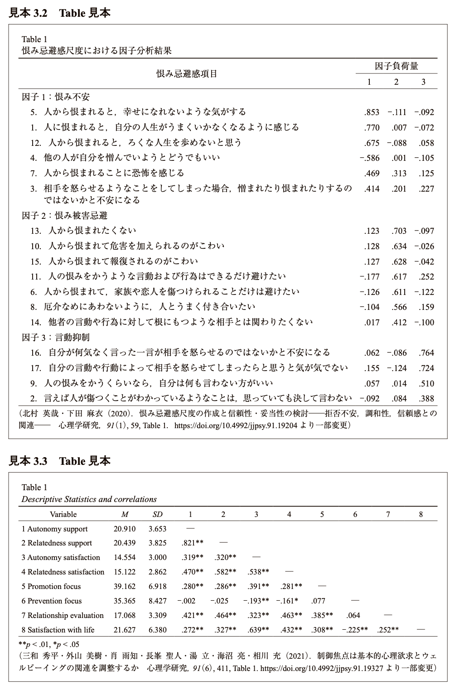
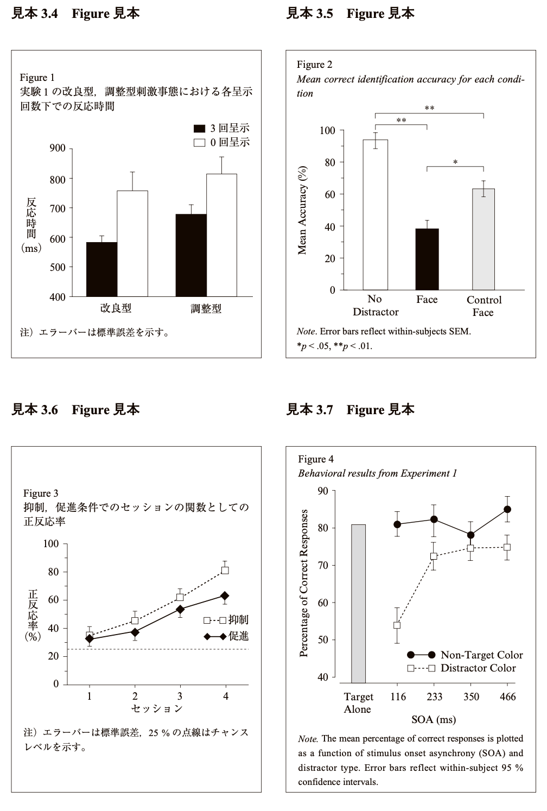
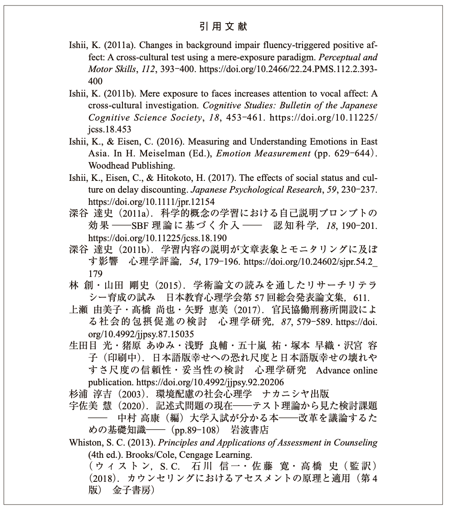
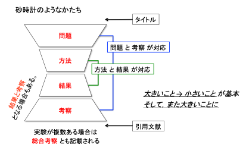
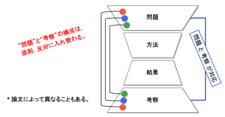

<!--フォントをUDフォントに-->
<link rel="preconnect" href="https://fonts.googleapis.com">
<link rel="preconnect" href="https://fonts.gstatic.com" crossorigin>
<link href="https://fonts.googleapis.com/css2?family=BIZ+UDPMincho:wght@400;700&display=swap" rel="stylesheet">

# 1. 第1章 はじめに

## 1.1. 実験・調査結果を発表するために
心理学，人間工学，認知科学，行動科学の研究は，机に向かって本を読んだり考えたりするだけでは終わりません。もちろん研究を始める上でそれらは欠かすことができませんが，一度仮説が立てられたら，実際に実験・調査を行って，その仮説が正しいかどうかを検証する必要があります。また，実験や調査結果がこれまでに報告されていない新しいものだった場合は，学会発表をしたり，論文（レポート）にしたり，社会に成果を還元するために発表をする必要があります。そこで，以下の3点について習得することを目指します。

* 授業で行った実験や調査について，目的，方法，結果，考察を適切に記述できる。
* データの集計，グラフや表の作成，統計解析を自分でできる。
* 科学論文における一般的な書式を用いてレポートを作成できる。

## 1.2. 実験・調査実習，課題演習の基本方針

### 1.2.1. 授業の構成
実験・調査実習，課題演習では，各テーマで，実験とデータ整理，実験テーマに関する解説，文献購読，議論まで（またはその一部）を行います。

### 1.2.2. 出席について
全員が揃うまで授業を始められないため，遅刻や欠席は絶対にしないようにしてください。やむを得ない事情により出席できない場合は，担当教員まで連絡するようにしてください（欠席時のレポートの対応については担当教員に相談してください）。

### 1.2.3. 実験・調査実習，課題演習の流れ
 1. **実験や調査の実施** 
    * 各授業で行われる実験や調査については担当教員の指示に従ってください。実験や調査は毎回配布される教示書の記載事項と教員の説明によって要領を十分にのみこんでから開始してください。器具・装置の扱い方はもちろん，実験や調査の進め方について，細かい点まで教員の指示に従ってください。わずかな条件の違いが思わぬ結果の相違を生むこともあり，他のデータと比較できなくなることがあるためです。
 1. **結果の整理と統計的処理**
    * 実験や調査結果の集計の仕方は各教員の指示に従ってください。全員分のデータをまとめた後，エクセルを用いて結果の整理を行います。結果の整理後，表，グラフの作成，統計的処理を行います。
 1. **実験や調査の解説**
    * 授業の最初か最後に実験・調査テーマに関する授業を行う場合があります（テーマごとに異なります）。授業内容は序文と考察に関係します。その後，方法と結果の書き方について説明をし，レポート執筆を開始してもらいます。

## 1.2. レポートを書く際の一般的な注意事項
実験レポートでは単に実験を行ったことを報告するだけではなく，関連領域について文献を調べて，考察することが必要です。マニュアル，教示文をそのまま書き写しただけのレポートにしないようにしてください。また，他人のレポートの全部あるいは一部を複製して提出してはいけません。

### 1.2.1. レポート提出について
　レポートは，決められた期日までに提出してください（提出の仕方は教員の指示に従ってください）。締め切り期日までに提出されなかったレポートは遅延レポートとして減点します。

### 1.2.2. レポートの評価について
　提出されたレポートは，添削して返却します。実験実習の授業はレポートを書けるようになることが目的なので，合格基準に達していない場合は再提出を求めます。 

# 2. 第２章　レポートの書き方について

## 2.1. レポートの体裁
　心理学特殊実験のレポートは，パソコンのワードソフトを使って作成してください。レポートの体裁はチェックリストを見ながら説明します。

## 2.2. レポートの構成
　レポートは基本的には以下のような構成にしてください。以下，個々のパートについては順を追って説明します。

 * 表紙（P1）
 * 本文（P2)
    * 序論（または問題）
    * 目的
    * 方法
        * 参加者
        * 装置
        * 手続き
    * 結果
    * 考察 
    * 引用文献

１つの論文のなかに複数の実験を載せる場合は，「実験１」「実験２」…，というように，実験ごとに章立てをして，そのなかで「目的」「方法」「結果」「考察」の順番で記述していきます。そして最後の実験の章の後に，全実験の結果をまとめて総括的な議論を行う「総合考察」の章を設けるのが普通です。
（詳細は「全体・構成に関する確認」を参照）

## 2.3. 序論（または問題）・目的の書き方
論文の最初の部分であり，読者に対して論文全体の目指すものが何であるかを理解させるために書かれます。実験を行うことで明らかにしようとした問題に関して，過去に行われた先行研究を紹介します。すなわち，過去の研究と今回行った研究との関係を明らかにするという点で，実験の目的に直結する部分です。
次に「目的」では，実験の具体的な目的を記述していきます。実験で扱う独立変数と，従属変数，検討する仮説，その検証方法などを書きます。序論と目的では，時制は過去形となることに注意してください。
（詳細は「序論に関する確認」を参照）

 * 独立変数と従属変数について
    * 実験において、実験者が組織的に操作し，変化させる変数（条件）を独立変数( independent variables )といいます。一 方、独立変数の操作の結果として生じる行動の変化を従属変数( dependent variables )といいます。実験は、この独立変数(X)と従属変数(Y )との関数関係 Y = f(X) を決定する方法と考えられます。

## 2.4. 方法の書き方
　「方法」の記述の良し悪しは，記述されたことだけに基づいて，後日に第三者が実験を正しく再現することが可能かどうかで判断されます。どのような情報を含めるべきかの基準は，「後からレポートを読んだ人が正しく追試できるかどうか」です。必要な情報を過不足なく，簡潔にわかりやすく記述できるかが問われます。その際、文章の時制は過去形を用います。また箇条書きにしてはいけません。
（詳細は「方法に関する確認」を参照）

## 2.5. 結果
　結果のセクションでは，実験で得られた客観的な事実を記述します。方法と同じく過去形を用いてください。実験データをグラフか表で記述します。グラフか表を見ただけで，どの条件が示されているか分かるように書いてください。結果は得られたものを全て書き込む必要はありません。しかし，目的や考察で書かれていることに関連する結果は漏らさずに書く必要があります。
（詳細は「結果に関する確認」を参照）

 * **注意 ：特定データの除外について**
    * 実験過誤や事故など，やむを得ない理由によりデータの一部を処理から除外せざるを得ないことがあります。その場合，「参加者」の項目では実際に実験を行った人数を記述し，「手続き」または次節の「結果」の項で (1)いかなる理由によって，(2)何ケースのデータを除外したかを記述してください。除外に関する記述無しにデータを処理から除外することはしてはいけません。

### 2.5.1. 表の体裁

 
### 2.5.2. 図の体裁

### 2.5.3. 考察
　考察の章では，結果で示されたデータを分析して，根拠を明示しながら解釈・推論を行います。結果に現れた傾向を素直に解釈して，どこまで結論を導き出せるか考えながら記述します。重要なのは，研究の目的がどのくらい達成されたのか，仮説がどのくらい検証されたのかを明らかにすることです。目的と考察が一貫するように注意すべきです。さらに言うと，結果にもとづいて考察するわけなので，結果と考察で述べる内容は関連があるはずです。主観的な推測や飛躍した論理展開をしないように注意してください。実験の目的や結果に対する理解度が問われる部分でもあります。
（詳細は「考察に関する確認」を参照）* 事実にひれ伏せ
 科学的レポートでは，実験で得られた事実がもっとも重く，尊重されなければなりません。得られたデータが「美しい」仮説に合致しなかったといって，データがまちがっているといった「偽」の考察は事実にひれ伏すという根本的な姿勢に反するものです。

## 2.6. 引用文献について
論文中でどのように引用文献を参照するか，文献リストを記述するかは，学問分野ごとに標準的な方法が異なっています。心理学の場合には、アメリカ心理学会で標準的に定められた文献表記方法が一般的に用いられています。 

### 2.6.1. 本文中に引用する場合
 1. 著者が1人の場合
    * 英語
        * 本文中に文章として入れる場合
        「Watson(2001)は…と主張した。」
        * 括弧内に文献を示す場合
        「…であると考えられている(Watson, 2001)。」
    * 日本語
        * 本文中に文章として入れる場合
        「山田(1993)は…と主張した。」
        * 括弧内に文献を示す場合
        「…であると考えられている(山田, 1993)。」

 1. 著者が2人の場合
    * 英語
        * 本文中に文章として入れる場合
        「Watson & Humphreys (1997)は…と主張した。」
        * 括弧内に文献を示す場合
        「であると考えられている(Watson & Humphreys, 1997)。」
    * 日本語
        * 本文中に文章として入れる場合
        「山田・武田(1993)は…と主張した。」
        * 括弧内に文献を示す場合
        「…であると考えられている(山田・武田, 1993)。」
 1. 著者が3人以上の場合
    2度目以降は第一著者名以外は日本語文献では「他」，英語文献では「et al.」と略す。
    * 英語
        * 本文中に文章として入れる場合
        Watson et al. (2003)は…と主張した。」
        * 括弧内に文献を示す場合
        「…であると考えられている(Watson et al., 2003)。」

    * 日本語
        * 本文中に文章として入れる場合
        「山田他(1993)は…と主張した。」
        * 括弧内に文献を示す場合
        「…であると考えられている(山田他, 1993)。」

 1. 同一箇所での複数引用
　本文中の同一箇所でいくつかの文献を引用するときには，文末の同じ括弧内に著者の姓のアルファベット順にセミコロンで区切り，また同一著者については出版年順に並べてそれらをカンマで区切り示します。
 「…であった(石井, 1998; Kugihara, 1998, 2000; 南・三浦・釘原, 2001; 鈴木他, 1995)。」
 
### 2.6.2. 引用文献リストの例 
図2.6. 引用文献リストの例（2022年改訂版 執筆・投稿の手びきより引用）

 
 * 引用文献リストに並べる順番は，主に最初の著者の苗字によって決まります。英語・日本語も含めてアルファベット順です（日本語の場合はローマ字表記）。
 * 同一著者の論文を並べる順番は，単著の論文が一番上で，以降は第二著者の苗字に従って決めます。第二著者も同じ場合は第三著者といった順番です。
 * 著者が全て同じ場合は，その後の刊行年次が若い方から並べていきます。
 * 引用文献の表記が2行以上にわたる場合には，2行目以降を全角2文字（半角では４文字）分下げてください。
 * 記載順は雑誌の場合は，雑誌名，刊行年次，表題，雑誌名，巻，ページ, doiの順です(doiはある場合のみ)。

 1. 著者名
    * 英語
    著者名は,姓を先に書き，名(その頭文字)の順で書いてください。イニシャルの後にピリオドをつけ，次に 1 字あけてください。 各著者名はコンマで区切り，最後の著者の前に「コンマ」と「＆」をおきます。
    * 日本語
    著者名は,姓，名の順で書いてください。姓と名の間にコンマはいりません。共著の場合は各著者の間に中黒（・）を入れてください。

 1. 論文と雑誌に関する情報
    * 英語
    論文タイトル，雑誌名，巻数，最初と最後のページの順番で書いてください。論文タイトルは，最初の文字のみ大文字です。雑誌名と巻数はイタリック体（斜体）で記載してください。雑誌名の後にコンマを打ち，巻数でコンマ，次に最初と最後のページを２分ダッシュ（-）ではさんで, ピリオド，最後にdoi（ある場合）です。
    * 日本語
    論文タイトル，雑誌名，巻数，最初と最後のページ，doiの順番で書いてください。巻数はイタリック体（斜体）で記載してください。雑誌名の後にコンマを打ち，巻数でコンマ，次に最初と最後のページを2分ダッシュ（-）ではさんで，ピリオド，最後にdoi（ある場合）です。

これ以上の詳細な情報は，「2022年改訂版 執筆・投稿の手びき」を読んで下さい。

# 3. 第３章　論文・レポートの構成

## 3.1. 研究レポートの流れ
　レポートでは以下の図のように序文（問題）から結果にかけては大きい話（一般的な話）から小さい話（本研究に限定した話）に展開していき，結果から考察までは小さい話から大きい話にしていきます。
 
図3.1.　研究レポートの構成    
    
　

また，序文と考察は以下のように対応しています。序文の最終段落は研究目的と非常に関わりが深い段落なので，考察では最初の段落に書きます。序文の中段落は考察の中段落に，序文の第１段落は考察の最終段落と対応しています。論文（レポート）を執筆する際は，序文と考察の両方の対応関係を見ながら書き上げていきます。例えば，序文で書かれていることが考察で書かれているか，考察で新たに挙げたトピックについて序文で触れる必要があるかといったことを考慮しながら書き上げます。

図3.2.　研究レポートの構成    
    

## 3.2. 段落の分け方
　論文における段落は，１つのアイデア（メッセージ）を示す単位です。同じ内容は１つの段落にまとめてください。１つの段落には2文以上が必要です。1つの文章だけで終わってしまう場合は，前の段落に含めてしまいましょう。

## 3.3. 段落内の構成
　各段落では，最初に１番言いたいことを言い（トピックセンテンス），次の文以降で補足説明をします（サポートセンテンス）。場合によっては最後にもう一度，主張を繰り返します（コンクルーディングセンテンス）。

### 3.3.1. 段落の最初の１文・トピックセンテンス
　各段落の最初の１文（トピックセンテンス）は，その段落に書かれている内容を要約したものにして下さい。これは，段落の見出しのようなもので，ここさえ読めばその段落で何を言おうとしているかが分かるように書いてください。つまり，それぞれの段落では，最初にこれから何を話すかを宣言しておき，その後ろに補足をつけるという形式になります。トピックセンテンスが無いと，その段落で何を言おうとしているのかが分かりにくくなります。段落内でも，基本的には大きいこと（この段落で何を説明するか）を言ってから小さいこと（具体的な例）を言っていくという流れです。

### 3.3.2. ２文目以降に続くサポートセンテンス
　トピックセンテンスに続く文のことをサポートセンテンスと呼びます。ここでは，トピックセンテンスについての具体的に説明を加える文章や，根拠を示すことが多いです。具体的には，先行研究がどのような実験内容であったのかを紹介します。サポートセンテンスは１つだけでは物足りないことが多く，2つ，3つと積み重ねることで段落に厚みが増していきます。
 * トピックセンテンスで何か主張が書かれている場合，サポートセンテンスではそれを支持する内容の先行研究が続きます。
 * トピックセンテンスで「主張Aと主張Bの間で議論が続いている」と書かれている場合，「立場Aの主張」が２文目，「その具体例」が3文目以降の前半の段落にあてられます。後半の段落は，「立場Bの主張」にあてられます。
 * 心理学の論文では時系列で説明する構造はあまりないですが，その場合もトピックセンテンス以降に説明が始まります。

### 3.3.3. 最後の１文，コンクルーディングセンテンス
　段落の最後にもってくる「まとめ」のセンテンスのことをコンクルーディングセンテンスといいます。段落内容に対する読者の理解を強化し、次の段落への移行をスムーズにする役割があります。通常はトピックセンテンスを別のかたちで言い換えます。短い段落で使うと文章がくどくなるので，省略されることが多いです。ある程度の長い段落で使ってください。

## 3.4. 読者を意識する
　文章を書く際に気をつけることは読者を意識することです。あなたのレポートを初めて読んだ人が途中でつまずかないように，必要な情報を適切に配置する必要があります。例えば，「ミュラーリヤー錯視」を説明する際に，段落の冒頭から「ミュラーリヤー錯視とは・・・である。」と書いてしまうと，ミュラーリヤー錯視を知らない人は話についていけなくなってしまいます。そこで「視覚において生じる錯覚は錯視と呼ばれ，その代表的なものの１つにミュラーリヤー錯視がある。ミュラーリヤー錯視とは・・・である。」といったように段階的に説明していきます。同様に，段落の冒頭の文で「これ」や「それ」といった指示代名詞を用いるのも控えてください。前の段落を読まないとわからなくなります（指示代名詞をできるだけ避け，具体的に書いた方が文章は分かりやすくなります）。
